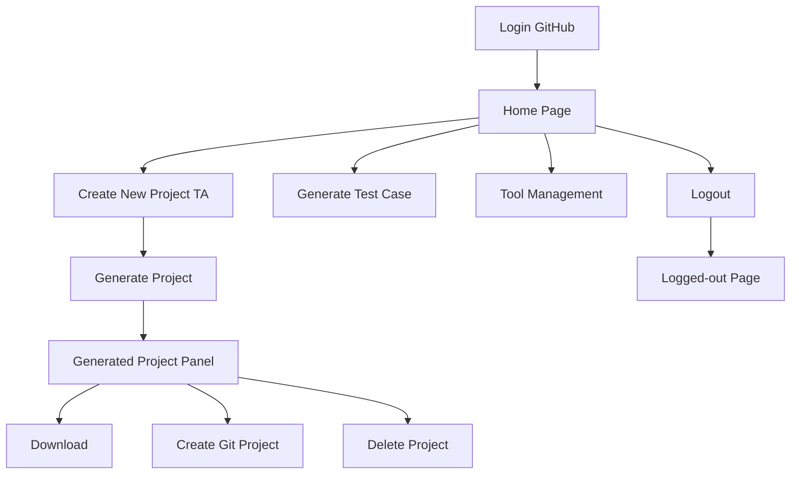
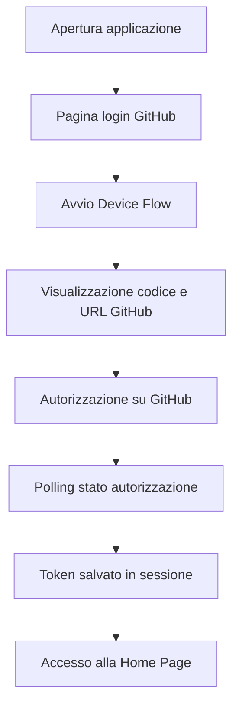
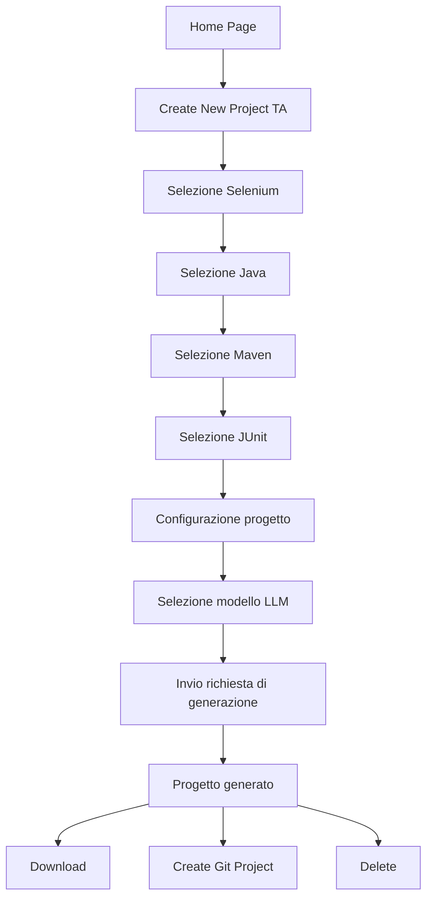
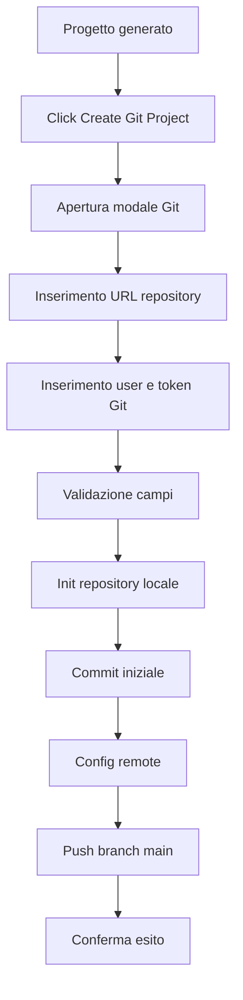
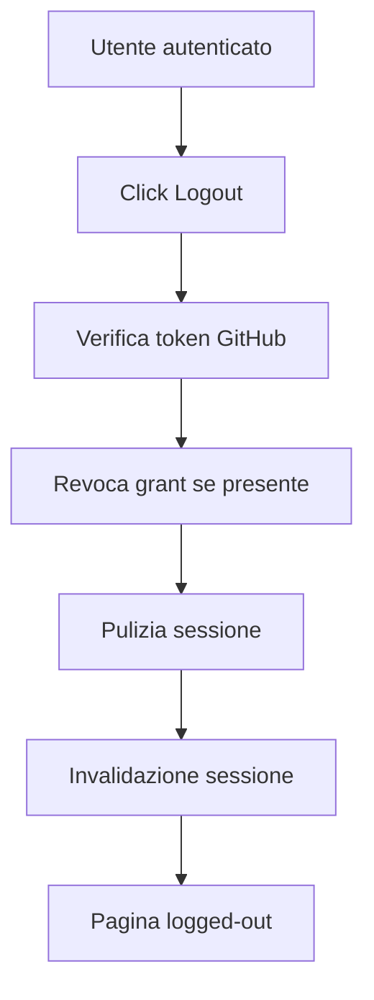

# GaikingCopilot - Documentazione Funzionale

## Scopo del Documento

Questo documento descrive il comportamento funzionale dell'applicazione GaikingCopilot dal punto di vista dell'utente e del processo operativo. L'obiettivo e chiarire:

- a chi serve l'applicazione
- quali funzionalita rende disponibili
- quali sono i casi d'uso principali
- quali prerequisiti sono necessari
- come si sviluppano i flussi utente principali
- quali sono gli esiti attesi e i casi di errore funzionali

## Obiettivo Applicativo

GaikingCopilot supporta l'utente nella generazione assistita di progetti di test automation e nell'utilizzo di GitHub Copilot all'interno di un workspace web semplificato.

Dal punto di vista funzionale, l'applicazione consente di:

1. autenticarsi con GitHub
2. accedere a pagine protette dell'applicazione
3. selezionare modelli Copilot compatibili
4. generare un progetto di automazione test Java Selenium Cucumber JUnit
5. scaricare il progetto generato
6. pubblicare il progetto su un repository Git remoto
7. eliminare il progetto dal filesystem locale
8. effettuare il logout locale e da GitHub

## Attori Coinvolti

### Utente Applicativo

Utente che accede all'applicazione via browser, esegue login GitHub, seleziona le funzionalita e interagisce con i form.

### GitHub

Sistema esterno usato per:

- autenticazione tramite Device Flow
- rilascio del token di accesso
- revoca del grant OAuth

### GitHub Copilot

Servizio esterno utilizzato per:

- recuperare modelli disponibili
- generare contenuti utili alla creazione del progetto di test automation

### Repository Git Remoto

Sistema esterno di destinazione della pubblicazione del progetto tramite URL repository remoto.

## Ambito Funzionale

L'applicazione copre i seguenti macro-processi:

- autenticazione e gestione sessione
- navigazione nelle pagine protette
- consultazione modelli Copilot
- generazione progetto test automation
- gestione del progetto generato
- logout

## Prerequisiti Funzionali

Per utilizzare le funzionalita applicative, devono essere soddisfatti i seguenti prerequisiti:

1. l'applicazione deve essere avviata correttamente
2. l'utente deve disporre di un account GitHub valido
3. l'utente deve completare con successo l'autenticazione GitHub
4. per la pubblicazione Git, l'utente deve possedere:
   - URL repository remoto valido
   - username Git
   - token Git valido

## Navigazione Utente

## Mappa delle Schermate

| Schermata | Funzione |
| --- | --- |
| `authGitHub` | avvio autenticazione GitHub |
| `homePage` | accesso alle azioni principali |
| `createNewProjectTa` | configurazione e gestione del progetto di test automation |
| `generateTestCase` | area dedicata alla generazione di test case |
| `toolManagement` | area di gestione strumenti |
| `logout` | conferma o passaggio al flusso di uscita |
| `logged-out` | pagina finale di avvenuto logout |

## Flusso di navigazione principale

## Regole Generali di Accesso

Le pagine applicative protette sono accessibili solo se:

1. la sessione utente e presente e non scaduta
2. nella sessione e presente un token GitHub valido

Se una di queste condizioni non e soddisfatta, l'utente viene reindirizzato alla schermata di login GitHub.

## Casi d'Uso

## UC-01 - Autenticarsi con GitHub

### Obiettivo

Consentire all'utente di ottenere una sessione autenticata per usare le funzionalita dell'applicazione.

### Attore principale

Utente Applicativo

### Precondizioni

- applicazione disponibile
- utente non autenticato oppure sessione non valida

### Trigger

L'utente apre la pagina di login o viene reindirizzato automaticamente al login.

### Scenario principale

1. L'utente apre la pagina di autenticazione GitHub.
2. Il sistema avvia il Device Flow.
3. Il sistema mostra all'utente il codice di autorizzazione e l'URL da aprire su GitHub.
4. L'utente apre GitHub e inserisce il codice richiesto.
5. Il sistema effettua polling sullo stato dell'autorizzazione.
6. GitHub conferma l'autorizzazione.
7. Il sistema salva il token in sessione.
8. L'utente puo accedere alle pagine protette.

### Scenari alternativi

- l'utente non completa l'autorizzazione: lo stato resta `pending`
- GitHub richiede rallentamento del polling: il sistema aggiorna l'intervallo
- l'utente nega l'autorizzazione: esito `denied`
- il codice scade: esito `expired`

### Postcondizioni

- token GitHub disponibile in sessione
- utente abilitato all'accesso delle funzioni applicative

## UC-02 - Accedere alla Home Page

### Obiettivo

Consentire all'utente autenticato di raggiungere le funzioni principali del workspace.

### Attore principale

Utente Applicativo

### Precondizioni

- utente autenticato con GitHub

### Scenario principale

1. L'utente apre `/homePage`.
2. Il sistema verifica sessione e token.
3. Il sistema mostra la Home Page.
4. L'utente visualizza i pulsanti:
   - `Create New Project TA`
   - `Generate Test Case`
   - `Tool Management`

### Scenari alternativi

- sessione assente o scaduta: redirect al login
- token GitHub assente: redirect al login

### Postcondizioni

- l'utente puo scegliere una funzione di workspace

## UC-03 - Generare un nuovo progetto TA

### Obiettivo

Consentire all'utente di configurare e generare un progetto di test automation.

### Attore principale

Utente Applicativo

### Precondizioni

- utente autenticato
- accesso alla pagina `Create New Project TA`

### Scenario principale

1. L'utente apre `Create New Project TA`.
2. Il sistema mostra il pannello `Framework Selection` e il pannello `Generated Project`.
3. L'utente seleziona `Selenium`.
4. L'utente seleziona `Java`.
5. L'utente seleziona `Maven` o `Gradle`.
6. L'utente seleziona `JUnit`.
7. Il sistema apre la modale di configurazione JUnit.
8. L'utente seleziona il modello LLM disponibile.
9. L'utente compila i parametri di configurazione del progetto.
10. L'utente avvia la generazione.
11. Il sistema genera il progetto e aggiorna il pannello `Generated Project`.

### Dati richiesti nella configurazione

- Model LLM
- Reasoning Effort
- Project Name
- Group Id
- Java Version
- Selenium Version
- JUnit Version
- JUnit Platform Version
- Cucumber Version
- WebDriverManager Version
- Surefire Version
- Compiler Plugin Version

### Regole funzionali specifiche della configurazione JUnit

- tutti i campi testuali della modale sono obbligatori
- i campi testuali accettano solo lettere, numeri, spazio, punto, underscore e trattino
- `Project Name` non puo contenere cifre
- `Group Id` deve rispettare il formato `stringa1.stringa2` con sole lettere e un solo punto
- `Junit Version` deve avere una major version strettamente maggiore di 4
- valori come `4.X.X`, `4.13.2` o stringhe non numeriche non sono ammessi
- il controllo viene applicato prima dell'invio della richiesta e viene garantito anche lato backend con le stesse regole

### Esito atteso

Il sistema mostra un messaggio di progetto creato correttamente e abilita le azioni successive sul progetto generato.

### Scenari alternativi

- campi obbligatori mancanti: il sistema mostra un messaggio di validazione
- presenza di caratteri speciali non ammessi nei campi testuali: il sistema blocca l'operazione
- `Project Name` contenente cifre: il sistema blocca l'operazione
- `Group Id` non conforme al formato richiesto: il sistema blocca l'operazione
- `Junit Version` non valida, inclusi major minore o uguale a 4 o prefissi non ammessi: il sistema blocca l'operazione
- sessione non valida: l'utente viene reindirizzato al login

### Postcondizioni

- progetto generato su filesystem locale
- pannello `Generated Project` aggiornato con il nome del progetto e le azioni disponibili

## UC-04 - Visualizzare e selezionare un modello LLM

### Obiettivo

Consentire all'utente di consultare i modelli Copilot disponibili e usarne uno per la generazione.

### Attore principale

Utente Applicativo

### Precondizioni

- utente autenticato
- apertura della modale di configurazione JUnit

### Scenario principale

1. L'utente clicca su `Get Model LLM`.
2. Il sistema apre la modale dei modelli.
3. Il sistema carica l'elenco dei modelli disponibili.
4. L'utente seleziona un modello.
5. Il sistema valorizza il campo `Model LLM` e gli eventuali `Reasoning Efforts` disponibili.

### Postcondizioni

- modello selezionato e disponibile nel form di generazione

## UC-05 - Scaricare il progetto generato

### Obiettivo

Consentire all'utente di ottenere una copia compressa del progetto generato.

### Attore principale

Utente Applicativo

### Precondizioni

- esistenza di un progetto generato
- utente autenticato

### Scenario principale

1. Il pannello `Generated Project` mostra il pulsante `Download`.
2. L'utente clicca `Download`.
3. Il sistema recupera il progetto locale.
4. Il sistema comprime il contenuto in formato zip.
5. Il browser avvia il download del file.

### Scenari alternativi

- progetto non trovato: risposta `404`
- sessione non valida: risposta `401` e possibile ritorno al login

### Postcondizioni

- file zip disponibile lato utente

## UC-06 - Creare il repository Git del progetto

### Obiettivo

Consentire all'utente di collegare il progetto generato a un repository Git remoto ed eseguire il push iniziale.

### Attore principale

Utente Applicativo

### Precondizioni

- progetto generato localmente
- utente autenticato
- disponibilita di repository remoto, username Git e token Git

### Scenario principale

1. L'utente clicca il pulsante `Create Git Project` dal pannello del progetto generato.
2. Il sistema apre la modale `Create Git Project`.
3. Il sistema precompila il nome del progetto.
4. L'utente inserisce:
   - Repository Name
   - User Git
   - Token Git
5. L'utente conferma la creazione.
6. Il sistema valida i dati inseriti.
7. Il sistema inizializza il repository locale.
8. Il sistema aggiunge i file, crea il commit iniziale, configura il remote, crea/checkout del branch `main` ed esegue il push.
9. Il sistema conferma l'operazione.

### Regole funzionali specifiche

- `Repository Name` deve iniziare con `https://`
- `Repository Name` deve terminare con `.git`
- tutti i campi della modale sono obbligatori
- la modale `Create Git Project` usa una larghezza estesa per facilitare l'inserimento di URL repository completi

### Scenari alternativi

- campi vuoti: messaggio di validazione
- URL repository non valido: messaggio di validazione
- progetto non trovato: risposta `404`
- sessione non valida: risposta `401`
- errore Git o remote non raggiungibile: l'operazione fallisce e l'utente riceve un messaggio di errore

### Postcondizioni

- repository locale inizializzato
- progetto pubblicato sul repository remoto se il push termina correttamente

## UC-07 - Eliminare il progetto generato

### Obiettivo

Consentire all'utente di rimuovere dal filesystem locale un progetto precedentemente generato.

### Attore principale

Utente Applicativo

### Precondizioni

- progetto presente sul filesystem locale
- utente autenticato

### Scenario principale

1. L'utente clicca `Delete` nel pannello del progetto generato.
2. Il sistema identifica il percorso del progetto.
3. Il sistema elimina ricorsivamente file e cartelle del progetto.
4. Il sistema aggiorna lo stato funzionale della schermata.

### Note funzionali

Il sistema gestisce anche file Git locali in sola lettura, in particolare nella directory `.git`, per garantire la cancellazione completa anche in ambiente Windows.

### Scenari alternativi

- progetto non trovato: risposta `404`
- sessione non valida: risposta `401`
- file non eliminabile: errore applicativo con messaggio di fallimento

### Postcondizioni

- progetto rimosso dal filesystem locale

## UC-08 - Effettuare il logout

### Obiettivo

Consentire all'utente di chiudere la sessione applicativa e, ove possibile, revocare l'autorizzazione GitHub.

### Attore principale

Utente Applicativo

### Precondizioni

- utente autenticato o sessione attiva

### Scenario principale

1. L'utente avvia il logout.
2. Il sistema verifica se in sessione e presente un token GitHub.
3. Se il token e presente, il sistema tenta la revoca del grant GitHub.
4. Il sistema pulisce i dati di sessione.
5. Il sistema invalida la sessione.
6. L'utente viene reindirizzato o informato dell'avvenuto logout.

### Scenari alternativi

- nessun token GitHub presente: viene eseguito solo il logout locale
- revoca GitHub non confermata: il logout locale viene comunque completato

### Postcondizioni

- sessione invalidata
- dati OAuth rimossi dalla sessione

## Flussi Utente Principali

## Flusso FU-01 - Primo accesso e login

## Flusso FU-02 - Generazione progetto TA

## Flusso FU-03 - Pubblicazione su Git

## Flusso FU-04 - Logout

## Regole di Business e Vincoli Funzionali

## Regole di accesso

- senza autenticazione GitHub non si puo accedere alle pagine protette
- la sessione applicativa governa l'autorizzazione alla navigazione

## Regole di generazione progetto

- il progetto viene generato solo se tutti i parametri obbligatori sono valorizzati
- i campi testuali della configurazione devono rispettare il set di caratteri ammessi
- `Project Name` non puo contenere cifre
- `Group Id` deve avere il formato `stringa1.stringa2` con sole lettere
- `Junit Version` deve rappresentare una versione valida con major strettamente maggiore di 4
- la funzionalita effettivamente implementata lato generazione automatica e quella Maven Selenium JUnit Cucumber
- il progetto generato viene salvato localmente e poi reso disponibile per le azioni successive

## Regole di pubblicazione Git

- l'URL repository deve essere formalmente valido secondo il formato richiesto
- l'utente deve fornire credenziali Git compatibili con il remote
- il branch usato nel push iniziale e `main`

## Regole di cancellazione

- la cancellazione riguarda il progetto locale
- la rimozione deve includere tutte le sottocartelle e i file del progetto

## Messaggi ed Esiti Funzionali Attesi

### Esiti positivi tipici

- autenticazione completata correttamente
- progetto generato correttamente
- progetto Git creato correttamente
- progetto eliminato correttamente
- logout completato correttamente

### Esiti negativi tipici

- sessione scaduta
- token GitHub non disponibile
- campi obbligatori non compilati
- repository Git non valido
- progetto non trovato
- errore interno durante operazioni filesystem, Git o Copilot

## Requisiti Funzionali per Area

## RF-01 - Autenticazione

Il sistema deve consentire l'autenticazione utente tramite GitHub Device Flow e memorizzare in sessione lo stato necessario all'utilizzo delle funzionalita protette.

## RF-02 - Protezione pagine

Il sistema deve impedire l'accesso alle pagine applicative se la sessione o il token GitHub non sono validi.

## RF-03 - Selezione modello Copilot

Il sistema deve consentire il caricamento e la selezione di un modello LLM disponibile.

## RF-04 - Generazione progetto

Il sistema deve permettere la generazione guidata di un progetto di test automation a partire da parametri compilati dall'utente.

## RF-05 - Download progetto

Il sistema deve consentire di scaricare il progetto generato in formato compresso.

## RF-06 - Pubblicazione Git

Il sistema deve consentire la pubblicazione del progetto su repository Git remoto previa validazione dei dati richiesti.

## RF-07 - Eliminazione progetto

Il sistema deve consentire la cancellazione completa del progetto generato dal filesystem locale.

## RF-08 - Logout

Il sistema deve consentire il logout locale e tentare la revoca del grant GitHub quando disponibile.

## Criteri di Accettazione Funzionale

### Login

- dato un utente non autenticato, quando apre una pagina protetta, allora viene reindirizzato al login GitHub
- dato un utente che completa il Device Flow, quando GitHub autorizza, allora il sistema abilita l'accesso alla Home Page

### Generazione progetto

- dato un utente autenticato, quando compila tutti i campi richiesti e avvia la generazione Maven, allora il sistema restituisce il progetto generato
- dato un utente che lascia campi obbligatori vuoti, quando tenta di generare il progetto, allora il sistema mostra un errore di validazione
- dato un utente che inserisce caratteri speciali non ammessi in un campo testuale, quando tenta di generare il progetto, allora il sistema blocca l'operazione con messaggio di validazione
- dato un utente che inserisce un `Project Name` contenente cifre, quando tenta di generare il progetto, allora il sistema blocca l'operazione con messaggio di validazione
- dato un utente che inserisce un `Group Id` non conforme al formato richiesto, quando tenta di generare il progetto, allora il sistema blocca l'operazione con messaggio di validazione
- dato un utente che inserisce una `Junit Version` con major minore o uguale a 4, quando tenta di generare il progetto, allora il sistema blocca l'operazione con messaggio di validazione

### Create Git Project

- dato un progetto generato, quando l'utente apre la modale Git, allora il nome progetto viene precompilato
- dato un repository name che non rispetta il formato `https://... .git`, quando l'utente invia la richiesta, allora il sistema blocca l'operazione
- dato un input valido, quando il push termina correttamente, allora il sistema conferma la creazione del progetto Git

### Delete

- dato un progetto esistente, quando l'utente clicca `Delete`, allora il progetto viene eliminato dal filesystem locale

### Logout

- dato un utente autenticato, quando esegue il logout, allora la sessione viene invalidata

## Limitazioni Funzionali Attuali

- il percorso `Gradle` non attiva ancora una generazione equivalente a quella Maven
- il comportamento complessivo dipende dalla disponibilita dei servizi esterni GitHub e Copilot
- le pagine `Generate Test Case` e `Tool Management` risultano presenti nella navigazione, ma questo documento si concentra soprattutto sui flussi oggi piu evidenti e documentabili dal codice disponibile

## Sintesi Finale

Dal punto di vista funzionale, GaikingCopilot e una web application che accompagna l'utente in un percorso guidato:

1. autenticazione con GitHub
2. accesso al workspace applicativo
3. configurazione della generazione di un progetto TA
4. gestione del progetto generato con download, pubblicazione Git e cancellazione
5. chiusura della sessione con logout

L'esperienza utente e costruita intorno a schermate semplici, modali guidate e controlli di validazione che riducono gli errori di compilazione dati e supportano il completamento del flusso principale end-to-end.
