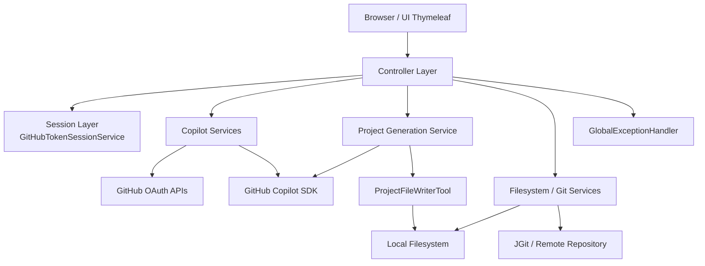
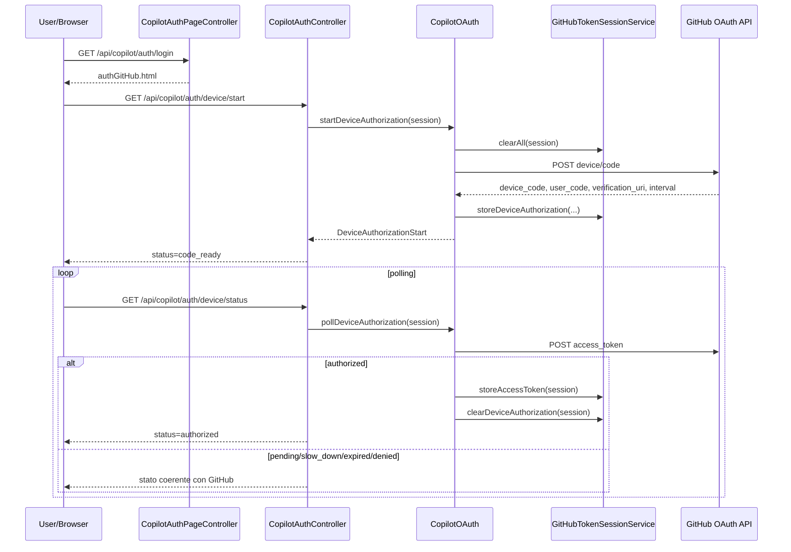
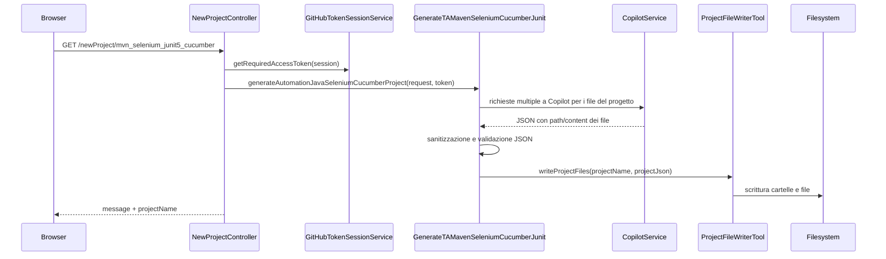
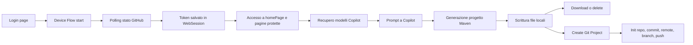

# GaikingCopilot - Documentazione Tecnica

## Overview

GaikingCopilot e un'applicazione Spring Boot che combina:

- interfaccia web server-side con Thymeleaf
- endpoint REST sincroni e reattivi
- integrazione con GitHub OAuth Device Flow
- integrazione con GitHub Copilot tramite SDK Java
- generazione di progetti di automazione test Java Selenium Cucumber JUnit
- gestione del ciclo di vita locale dei progetti generati: download, cancellazione e pubblicazione su repository Git remoti

L'applicazione usa `WebSession` per mantenere il token GitHub e lo stato del Device Flow, e centralizza logging e gestione errori tramite `Log4j2` e `GlobalExceptionHandler`.

## Obiettivi Tecnici

- autenticare l'utente verso GitHub usando Device Flow
- recuperare modelli Copilot disponibili e inviare prompt a Copilot
- generare un progetto di test automation Maven a partire da prompt strutturati
- scrivere i file generati sul filesystem locale
- comprimere, eliminare o versionare il progetto generato con JGit

## Stack Tecnologico

| Area | Tecnologia |
| --- | --- |
| Runtime | Java 25 |
| Framework | Spring Boot 4.0.6 |
| Web UI | Thymeleaf |
| Web/API | Spring WebFlux |
| Validazione | Spring Validation / Jakarta Validation |
| Logging | Log4j2 via Lombok `@Log4j2` |
| AI integration | `com.github:copilot-sdk-java` |
| Git integration | JGit |
| Utility I/O | Commons IO, Jackson |
| Frontend | Bootstrap 5, Bootstrap Icons, JavaScript vanilla |

## Architettura Logica



## Struttura del Progetto

```text
src/main/java/it/nttdata/gaikingCopilot
|-- GaikingCopilotApplication.java
|-- ai/
|   `-- GenerateTAMavenSeleniumCucumberJunit.java
|-- controller/
|   |-- AppSessionController.java
|   |-- AppSessionPageController.java
|   |-- CopilotAuthController.java
|   |-- CopilotAuthPageController.java
|   |-- CopilotController.java
|   |-- HomePageController.java
|   `-- NewProjectController.java
|-- exception/
|   |-- CustomException.java
|   `-- GlobalExceptionHandler.java
|-- model/
|   |-- AutomationProjectRequest.java
|   |-- CreateProjectGitRequest.java
|   |-- ModelCopilot.java
|   `-- RequestParameter.java
|-- service/
|   |-- copilot/
|   |   |-- CopilotOAuth.java
|   |   |-- CopilotService.java
|   |   `-- GitHubTokenSessionService.java
|   `-- git/
|       `-- GitRepositoryService.java
`-- utility/
	|-- OperationOnFileSystem.java
	|-- ProjectFileWriterTool.java
	|-- ReadAndWriteJson.java
	|-- RestApi.java
	`-- XmlMinifyService.java

src/main/resources
|-- application.yaml
|-- githubProprieties.yaml
|-- static/
|   |-- css/
|   |-- js/
|   `-- images/
`-- templates/
	|-- authGitHub.html
	|-- createNewProjectTa.html
	|-- generateTestCase.html
	|-- homePage.html
	|-- logged-out.html
	|-- logout.html
	`-- toolManagement.html
```

## Componenti Principali

### Entry Point

`GaikingCopilotApplication` avvia il contesto Spring Boot tramite `SpringApplication.run(...)`.

### Controller

| Controller | Tipo | Responsabilita principale |
| --- | --- | --- |
| `CopilotAuthPageController` | MVC | serve la pagina di login GitHub |
| `HomePageController` | MVC | protegge le pagine applicative verificando sessione e token GitHub |
| `AppSessionPageController` | MVC | serve le pagine di logout e logged-out |
| `CopilotAuthController` | REST reattivo | gestisce start e polling del GitHub Device Flow |
| `CopilotController` | REST | recupera modelli Copilot e invia prompt di test a Copilot |
| `NewProjectController` | REST | genera progetto, scarica zip, elimina progetto, inizializza repository Git |
| `AppSessionController` | REST reattivo | logout applicativo e revoca grant GitHub |

### Service Layer

| Service | Responsabilita |
| --- | --- |
| `GitHubTokenSessionService` | persistenza e validazione dello stato OAuth nella `WebSession` |
| `CopilotOAuth` | integrazione con GitHub Device Flow e revoca grant OAuth |
| `CopilotService` | wrapping della `CopilotClient` per listing modelli e richieste chat streaming/non-streaming |
| `GitRepositoryService` | operazioni Git locali e push remoto tramite JGit |

### AI / Generation Layer

`GenerateTAMavenSeleniumCucumberJunit` costruisce prompt dedicati per i file del progetto, invoca Copilot, valida il JSON di output, tenta correzioni locali e un retry controllato, poi delega la scrittura dei file a `ProjectFileWriterTool`.

### Utility Layer

| Utility | Responsabilita |
| --- | --- |
| `ProjectFileWriterTool` | scrittura dei file generati a partire da un JSON `{ files: [...] }` |
| `ReadAndWriteJson` | parsing, serializzazione, sanitizzazione e validazione JSON |
| `RestApi` | wrapper WebClient per chiamate HTTP/HTTPS esterne |
| `OperationOnFileSystem` | zip e delete ricorsivo dei progetti generati |
| `XmlMinifyService` | normalizzazione e pretty print XML |

## Modelli

| Modello | Tipo | Utilizzo |
| --- | --- | --- |
| `AutomationProjectRequest` | record | input interno per la generazione del progetto Maven Selenium Cucumber JUnit |
| `CreateProjectGitRequest` | DTO validato | body della API di pubblicazione Git |
| `ModelCopilot` | DTO response | risposta normalizzata dei modelli Copilot per il frontend |
| `RequestParameter` | record | contenitore generico per parametri HTTP, attualmente secondario rispetto a `RestApi` |

## Template e Frontend

La UI e renderizzata lato server tramite Thymeleaf, con logica client-side in JavaScript vanilla. Le pagine principali sono:

- `authGitHub.html`: schermata di autenticazione GitHub
- `homePage.html`: landing page protetta post-login
- `createNewProjectTa.html`: configurazione e lifecycle dei progetti TA
- `generateTestCase.html`: pagina dedicata ai test Copilot
- `toolManagement.html`: pagina strumenti
- `logout.html` e `logged-out.html`: flusso di chiusura sessione

## API e Flussi Applicativi

### 1. Login GitHub Device Flow

#### Endpoint principali

| Metodo | Path | Descrizione |
| --- | --- | --- |
| `GET` | `/api/copilot/auth/login` | pagina di login |
| `GET` | `/api/copilot/auth/device/start` | avvio del Device Flow |
| `GET` | `/api/copilot/auth/device/status` | polling stato autorizzazione |
| `POST` | `/api/copilot/auth/logout` | logout con revoca grant |

#### Sequence descrittiva



### 2. Navigazione protetta delle pagine

`HomePageController` applica una protezione semplice lato server:

- se `WebSession` e assente o scaduta, redirect a `/api/copilot/auth/login`
- se il token GitHub non e presente in sessione, redirect a `/api/copilot/auth/login`
- altrimenti viene renderizzata la view richiesta

Pagine protette:

- `/homePage`
- `/homePage/createNewProjectTa`
- `/homePage/generateTestCase`
- `/homePage/toolManagement`

### 3. Recupero modelli Copilot e invio prompt

#### Endpoint principali

| Metodo | Path | Descrizione |
| --- | --- | --- |
| `GET` | `/getCopilotModels` | elenca i modelli Copilot disponibili |
| `GET` | `/getTestCopilot` | invia un prompt a Copilot in modalita streaming o non-streaming |

#### Comportamento

- `CopilotController` legge il token GitHub dalla sessione
- `CopilotService` crea una `CopilotClient`
- per `/getCopilotModels` richiama `client.listModels()` e mappa l'output in `ModelCopilot`
- per `/getTestCopilot` usa:
  - `getResponseCopilotWithStreaming(...)` se `streaming=true`
  - `getResponseCopilotWhitOutStreaming(...)` se `streaming=false`

#### Note tecniche sullo streaming

`CopilotService` registra listener per:

- `AssistantMessageDeltaEvent`
- `AssistantMessageEvent`
- `SessionErrorEvent`
- `SessionIdleEvent`

Il contenuto viene aggregato in uno `StringBuilder` fino al completamento della sessione.

### 4. Generazione progetto TA

#### Endpoint principali

| Metodo | Path | Descrizione |
| --- | --- | --- |
| `GET` | `/newProject/mvn_selenium_junit5_cucumber` | genera il progetto Maven |
| `GET` | `/newProject/gradle_selenium_junit5_cucumber` | attualmente restituisce solo path e messaggio, senza generazione effettiva |
| `GET` | `/newProject/download` | scarica il progetto in formato zip |
| `DELETE` | `/newProject/delete` | elimina il progetto locale |
| `POST` | `/newProject/createProjectGit` | inizializza repository Git e fa push remoto |

#### Flow descrittivo di generazione Maven



#### File generati dal generatore AI

Tra i file costruiti dinamicamente compaiono almeno:

- `pom.xml`
- classi `pages/*`
- factory e hook di test
- runner Cucumber
- step definition
- feature file di esempio

Il generatore richiede che Copilot restituisca JSON valido monolinea con path e contenuto; se il JSON non e valido prova:

- sanitizzazione locale
- normalizzazione escape
- un retry controllato verso Copilot con prompt di repair

### 5. Pubblicazione su Git remoto

`POST /newProject/createProjectGit` esegue la seguente pipeline:

1. validazione body `CreateProjectGitRequest`
2. verifica sessione e token GitHub applicativo
3. verifica esistenza del progetto locale
4. `GitRepositoryService.initializeRepository(...)`
5. `addFiles(...)`
6. `commit(...)`
7. `addRemote(...)`
8. `checkoutBranch("main")`
9. `push(...)`

## Validazioni

### Validazioni lato controller

- `@Validated` in `NewProjectController`
- `@NotBlank` sui query parameter di generazione progetto
- controlli espliciti su sessione e token nei controller che richiedono autenticazione

### Validazioni lato DTO

`CreateProjectGitRequest` valida:

- `projectName` obbligatorio
- `repositoryName` obbligatorio e conforme a `^https://.+\.git$`
- `userGit` obbligatorio
- `tokenGit` obbligatorio

### Validazioni lato service

- `GitHubTokenSessionService` valida presenza e coerenza dei dati in sessione
- `CopilotService` valida `githubToken`, `model`, `prompt`
- `GenerateTAMavenSeleniumCucumberJunit` valida il contenuto di `AutomationProjectRequest`

### Validazioni lato frontend

La pagina `createNewProjectTa.html` e il relativo JavaScript applicano validazioni preventive sui form, inclusa la verifica del formato del repository Git remoto.

## Logging

### Configurazione

Il logging e configurato in `application.yaml`:

- file di output: `logs/gaikingCopilot.log`
- livello root: `INFO`
- pattern file: `%d{yyyy-MM-dd HH:mm:ss} - %msg%n`

### Strategia adottata

- controller: log di ingresso richiesta, esito positivo, redirect o rifiuto per sessione/token assente
- service: log di operazione, esito, warning di validazione e errori tecnici
- exception handler: log centralizzato delle eccezioni propagate
- utility filesystem: log puntuali sui casi tecnici come la rimozione dell'attributo read-only su Windows

### Note

L'uso di `@Log4j2` e diffuso nei controller, service, utility e exception handler per rendere tracciabile l'intero flusso applicativo.

## Gestione Errori

### `GlobalExceptionHandler`

Gestisce centralmente:

- `CustomException`
- `IllegalArgumentException`
- `ConstraintViolationException`
- `URISyntaxException`
- `GitAPIException`
- `MethodArgumentNotValidException`
- fallback `Exception`

### Mappatura generale

| Eccezione | Esito |
| --- | --- |
| `CustomException` | status dinamico e body con `status`, `error`, `cause` |
| `MethodArgumentNotValidException` | `400 Bad Request` con messaggio del primo field error |
| `IllegalArgumentException` / `ConstraintViolationException` | `400 Bad Request` |
| eccezione non gestita | `500 Internal Server Error` |

### Error handling locale nei controller reattivi

`CopilotAuthController` e `AppSessionController` usano `onErrorResume(...)` per produrre risposte JSON controllate nei flussi reattivi dove il controller decide di degradare il comportamento invece di lasciare propagare integralmente l'errore.

### `CustomException`

`CustomException` trasporta:

- `message`
- `statusCode`
- `cause`

Viene usata in particolare per incapsulare errori Copilot e errori di scrittura file.

## Configurazioni

### `application.yaml`

Responsabilita principali:

- definizione nome applicazione
- import di `githubProprieties.yaml`
- configurazione del logging su file

### `githubProprieties.yaml`

Contiene:

- `github.oauth.client-id`
- `github.oauth.client-secret`
- `github.oauth.device-code-url`
- `github.oauth.access-token-url`

### Nota operativa importante

Attualmente le credenziali OAuth risultano presenti in un file versionato sotto `src/main/resources`. In un ambiente reale e consigliato esternalizzarle tramite:

- variabili d'ambiente
- secret manager
- file di configurazione esclusi dal versionamento

## Dipendenze Principali

| Dipendenza | Scopo |
| --- | --- |
| `spring-boot-starter-thymeleaf` | rendering server-side delle pagine |
| `spring-boot-starter-webflux` | API HTTP e WebClient reattivo |
| `spring-boot-starter-validation` | validazione request e DTO |
| `copilot-sdk-java` | integrazione con GitHub Copilot |
| `commons-io` | utility I/O |
| `org.eclipse.jgit` | operazioni Git locali e push remoto |
| `lombok` | riduzione boilerplate |

## Considerazioni di Sicurezza e Hardening

### Aspetti gia presenti

- validazione input lato frontend e backend
- parsing XML con `FEATURE_SECURE_PROCESSING` e disabilitazione DTD/entita esterne in `XmlMinifyService`
- gestione centralizzata degli errori

### Aspetti da considerare in produzione

- `RestApi` usa `InsecureTrustManagerFactory`, quindi accetta certificati SSL non fidati: e utile in sviluppo ma non e adatto a produzione
- le credenziali GitHub OAuth non dovrebbero risiedere in un file di risorse versionato
- i token Git e GitHub dovrebbero essere ulteriormente protetti e possibilmente non transitare in chiaro lato UI

## Sequence / Flow Descrittivi Riassuntivi

### Flow completo di login, uso Copilot e generazione progetto



## Build e Avvio

### Build

```bash
mvn clean package
```

### Avvio da jar

```bash
java -jar target/gaikingCopilot-0.0.1-SNAPSHOT.jar
```

### Compile check rapido

```bash
./mvnw.cmd -q -DskipTests compile
```

## Note Tecniche e Limiti Attuali

- il path Gradle attualmente restituisce un messaggio di successo e il path target, ma non invoca ancora un generatore equivalente a quello Maven
- il generatore AI e fortemente dipendente dalla qualita del JSON restituito dal modello, per questo include logica di repair e retry
- la cancellazione ricorsiva su Windows gestisce l'attributo read-only prima di eliminare i file, in particolare per directory `.git` generate localmente
- l'applicazione mescola controller MVC tradizionali e controller REST reattivi, scelta funzionale ma da considerare nel design futuro se si volesse uniformare lo stack

## Sintesi Finale

GaikingCopilot e un backend Spring Boot orientato a tre capability principali:

1. autenticazione GitHub con mantenimento dello stato in sessione
2. interrogazione e utilizzo di GitHub Copilot per generazione contenuti
3. orchestrazione locale di progetti di automazione test con supporto a download, delete e pubblicazione Git

Il codice e organizzato in modo chiaro per package, con logging diffuso, validazioni multi-livello, gestione errori centralizzata e una separazione sufficientemente netta tra web layer, service layer, AI generation e utility di supporto.
